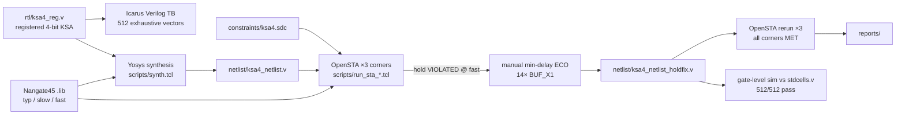

# 4-bit Kogge–Stone Adder — Yosys Synthesis + OpenSTA Multi-Corner STA

An open-source-EDA equivalent of a Cadence **Genus (synthesis) + Tempus (STA)**
flow: a registered 4-bit Kogge–Stone adder is synthesized with **Yosys** to the
**Nangate45** standard-cell library, constrained with a hand-written **SDC**,
and timed with **OpenSTA** at three PVT corners. A real fast-corner **hold
violation** was found and closed with a manual min-delay buffering **ECO**,
then everything was re-verified by exhaustive gate-level simulation.

Every number in this README comes directly from a tool report checked into
[`reports/`](reports/) — nothing is estimated.

## Results at a glance

| Metric | Pre-ECO | Post-ECO (final) |
|---|---|---|
| Clock constraint | 500 MHz (2.0 ns) | 500 MHz (2.0 ns) |
| Cells / area (Yosys `stat`) | 34 / 98.952 µm² | 48 / 110.124 µm² |
| Worst setup slack (slow corner) | +0.8332 ns | +0.5313 ns |
| Worst hold slack (fast corner) | **−0.0354 ns (VIOLATED)** | **+0.0064 ns (MET)** |
| WNS / TNS (all corners, setup) | 0.00 / 0.00 | 0.00 / 0.00 |
| Power, typical (vectorless estimate) | ≈45.3 µW | ≈51.7 µW |
| Functional verification | 512/512 vectors (RTL) | 512/512 vectors (RTL **and** gate level) |


## Flow



## Repository layout

```
rtl/           ksa4_reg.v            registered 4-bit Kogge–Stone adder
tb/            ksa4_tb.v             exhaustive self-checking testbench
lib/           NangateOpenCellLibrary_{typical,slow,fast}.lib
constraints/   ksa4.sdc              hand-written constraints
scripts/       synth.tcl             Yosys synthesis script
               run_sta_{slow,fast,typ}.tcl   per-corner OpenSTA runs
               run_power_typ.tcl     vectorless power estimate
netlist/       ksa4_netlist.v        raw synthesis netlist (pre-ECO)
               ksa4_netlist_holdfix.v  final netlist after hold-fix ECO
reports/       all tool output: timing/area/power reports + summary.md
docs/img/      charts used in this README
```

## Tools and libraries

| Component | Version / source | Role |
|---|---|---|
| Yosys | 0.33 | RTL synthesis + technology mapping (ABC) |
| OpenSTA | 2.4.0 (via OpenLane docker image) | Multi-corner static timing analysis, power estimate |
| Icarus Verilog | 12.0 | RTL and gate-level functional simulation |
| Nangate45 typical lib | `NangateOpenCellLibrary` (`default_operating_conditions: typical`) | Synthesis target + baseline STA corner |
| Nangate45 slow lib | `NangateOpenCellLibrary_slow` (slow ≈ SS/low-V/high-T) | Setup-critical corner |
| Nangate45 fast lib | `NangateOpenCellLibrary_fast` (fast ≈ FF/high-V/low-T) | Hold-critical corner |

The three corner `.lib` files are the Nangate45 corners shipped with the
[OpenSTA upstream examples](https://github.com/parallaxsw/OpenSTA/tree/master/examples)
(`nangate45_{typ,slow,fast}.lib.gz`).

## Design

`rtl/ksa4_reg.v` — 4-bit Kogge–Stone adder with **flopped inputs and outputs**
(9 input flops for `a`, `b`, `cin`; 5 output flops for `sum`, `cout`) so STA
sees real register-to-register paths, plus async active-low reset `rst_n`.
Prefix structure:

1. Bit-level generate/propagate: `g0 = a & b`, `p0 = a ^ b`, `cin` folded into
   the bit-0 generate
2. Prefix level 1 (span 1), prefix level 2 (span 2) — standard 4-bit
   Kogge–Stone tree
3. `sum = p0 ^ {g2[2:0], cin}`, `cout = g2[3]`

## Synthesis techniques (Yosys, `scripts/synth.tcl`)

| Step | Command | Genus rough equivalent | Purpose |
|---|---|---|---|
| Elaboration | `hierarchy -check -top ksa4_reg` | `elaborate` | Resolve module hierarchy, set top |
| Generic optimization | `proc; opt; fsm; opt; memory; opt` | `syn_generic` | Processes → netlist, constant folding, FSM/memory extraction |
| Generic tech mapping | `techmap; opt` | `syn_generic` | Map RTL cells to generic gates |
| Flop mapping | `dfflibmap -liberty <typical.lib>` | part of `syn_map` | Map flops to library `DFFR_X1` (async-reset flop) |
| Logic mapping | `abc -liberty <typical.lib>` | `syn_map` / `syn_opt` | ABC technology mapping + optimization to liberty gates |
| Reporting | `stat -liberty <typical.lib>` | `report_area` | Cell count + area from liberty cell areas |


## SDC specification (`constraints/ksa4.sdc`)

| Constraint | Value | Command |
|---|---|---|
| Clock | 2.0 ns period (500 MHz) on port `clk` | `create_clock` |
| Clock uncertainty | 0.10 ns | `set_clock_uncertainty` |
| Clock latency (ideal network) | 0.30 ns | `set_clock_latency` |
| Input delay | 0.40 ns on `a`, `b`, `cin` | `set_input_delay -clock clk` |
| Output delay | 0.40 ns on `sum`, `cout` | `set_output_delay -clock clk` |
| Input boundary model | `BUF_X2` cell assumed as external driver (realistic input slews) | `set_driving_cell -lib_cell BUF_X2` |
| Output boundary model | 0.02 pF capacitive load on all outputs | `set_load 0.02` |
| Reset exclusion | false path from async reset `rst_n` | `set_false_path -from` |
| Multicycle paths | **none, deliberately** — every reg-to-reg path here is a genuine single-cycle path | — |

## STA methodology (OpenSTA, `scripts/run_sta_*.tcl`)

| Aspect | Setting |
|---|---|
| Corners | 3 separate runs: slow, typical, fast liberty (Tempus-style dual-corner + baseline) |
| Setup analysis | `report_checks -path_delay max -fields {slew cap input_pin_activity} -digits 4` |
| Hold analysis | `report_checks -path_delay min -digits 4` |
| Slack summaries | `report_wns`, `report_tns` (note: these cover **max/setup paths only** in OpenSTA) |
| ECO verification | `report_checks -path_delay min -slack_max 0.10 -endpoint_count 50` (all endpoints, not just worst path) |
| Power | `report_power`, vectorless (default activity — estimate only, not signoff) |

### Final timing (post-ECO netlist)

| Corner | Setup slack | Setup critical path | Hold slack | Report |
|---|---|---|---|---|
| slow | +0.5313 ns MET | `b[0]` flop → carry chain (+4 ECO buffers) → `cout` flop, 1.2131 ns data delay | +0.2904 ns MET | `setup_slow.rpt` / `hold_slow.rpt` |
| typical | +1.4055 ns MET | `cout` flop → output port | +0.0800 ns MET | `setup_typ.rpt` / `hold_typ.rpt` |
| fast | +1.4454 ns MET | `cout` flop → output port | +0.0064 ns MET | `setup_fast.rpt` / `hold_fast.rpt` |

The cross-corner behavior is the textbook finding: **setup slack degrades
toward the slow corner, hold slack tightens toward the fast corner** — setup
is bounded by the slow library, hold by the fast library, which is why
dual-corner STA is required at all.

### Power


Vectorless `report_power` at the typical corner (OpenSTA default activity
assumptions, no SAIF/VCD): **rough estimates, not signoff numbers.** The
ECO's 14 buffers cost ≈6 µW.

## Issues faced and fixes

| # | Issue | Root cause | Fix |
|---|---|---|---|
| 1 | **Fast-corner hold violation, −0.0354 ns** — ~50 violating min-paths | Shortest reg-to-reg paths (single XNOR between flops) too fast to cover 0.10 ns clock uncertainty + flop hold time at the fast corner | Manual min-delay padding ECO: `BUF_X1` chains at the 5 output-register D pins (2 buffers on `sum[1..3]`, 4 on `sum[0]`/`cout`; 14 total). Iterated twice against actual OpenSTA numbers. Cost measured: 0.30 ns slow-corner setup slack, 11.172 µm² area, ≈6 µW. Re-verified: all endpoints MET, gate-level sim 512/512 |
| 2 | `set_driving_cell -library <file path>` rejected | OpenSTA's `-library` expects a loaded liberty *name*, and the three corners have different library names | Dropped `-library`; `-lib_cell BUF_X2` resolves from whichever corner lib is loaded |
| 3 | No native `sta` binary on the machine | OpenSTA never installed system-wide | Ran OpenSTA 2.4.0 from the local OpenLane docker image with the project directory mounted |
| 4 | Only the typical Nangate45 `.lib` existed locally | Local copy came from a Fault checkout that ships one corner | Downloaded the slow/fast (and matching typical) corner libs from the OpenSTA upstream examples |
| 5 | `report_wns`/`report_tns` showed 0.00 while hold was violated | These OpenSTA commands summarize **max (setup) paths only** | Treated `hold_*.rpt` min-path reports as the source of truth for hold status |

## Verification

- **RTL:** exhaustive 512-vector self-checking Icarus testbench (all 16×16×2
  input combinations) — 512/512 pass.
- **Post-ECO gate level:** same testbench run against
  `netlist/ksa4_netlist_holdfix.v` + Nangate45 Verilog cell models — 512/512
  pass, proving the ECO changed timing only, not function.

## Reproducing

```bash
# functional sim (RTL)
iverilog -o ksa4_tb.vvp tb/ksa4_tb.v rtl/ksa4_reg.v && vvp ksa4_tb.vvp

# synthesis (area report -> reports/yosys_area.rpt)
yosys -s scripts/synth.tcl | tee reports/yosys_area.rpt

# STA, one run per corner (native OpenSTA, or via the OpenLane docker image)
sta -exit scripts/run_sta_slow.tcl
sta -exit scripts/run_sta_fast.tcl
sta -exit scripts/run_sta_typ.tcl
```

## Honest-reporting notes

- Power is a **vectorless estimate** (default switching activity); with SAIF
  from the exhaustive testbench it could be made activity-accurate.
- The +0.0064 ns post-ECO fast-corner hold margin is thin by design: hold
  fixing pads to just-met because every extra buffer costs setup slack and
  area, and the 0.10 ns clock uncertainty inside the check is the guard band.
- The slow-corner setup number is the one that matters for the 500 MHz claim;
  the typical/fast worst paths are reg→port paths dominated by the 0.40 ns
  external output delay.
